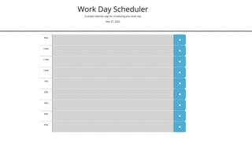

#Title
Work-Day-Scheduler

#Description
This application is a workday scheduler. This application allows users to input details on hour marks from 9:00am to 5:00pm. This application notates current time, by providing past, present, and future time blocks with specific colors, indicating the time status. This application allows users to save inputs they made in the scheduler to local storage.
To build this application, I utilized html, css, but mainly javascript. 
Building this application, I faced challenges with developing the code to save the inoputs to local storage.

#Installation/Run Project
To run this application, install VSCode to load the html, css, and javascript files and visit the following link to access this application https://.ericklea.github.io/work-day-scheduler/

#Usage 
To use this application follow this link https://.ericklea.github.io/work-day-scheduler/
Once you are on the application page, you will notice the header, reading "Workday Scheduler" as well as the current date. 
Next, you will notice there are timeblocks for working hours from 9:00am until 5:00pm.
By clicking on the space next to the timeblock, you are able to input text. Keep in mind, gray space indicates past time, red space indicates present time, and green space indicates future time.

After you have input the correct information for yourself in the scheduler, you are able to save your inputs by click the save button. 

Once you click save, your inputs are save to local storage. 

#Credits
For this project, I utilized html, css, and javascript starter code provided by The University of Utah Coding Bootcamp. Additionally, I utilized resources from https://youtube.com https://w3schools.com https://stakeoverflow.com and as well, I received help on building this application from University of Utah Coding Bootcamp tutor Ben Martin and TA Brandon Ashby and TA Ben Bushman.

